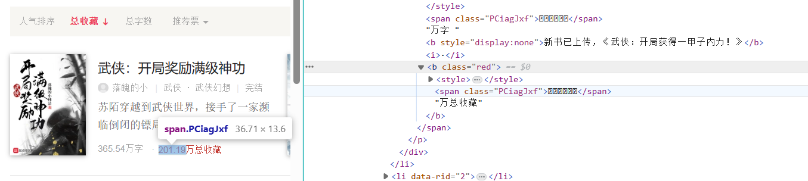
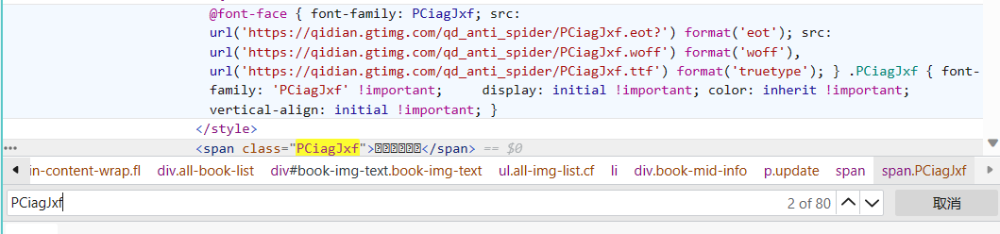
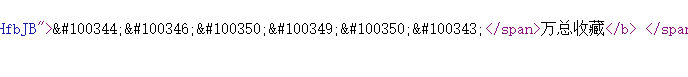
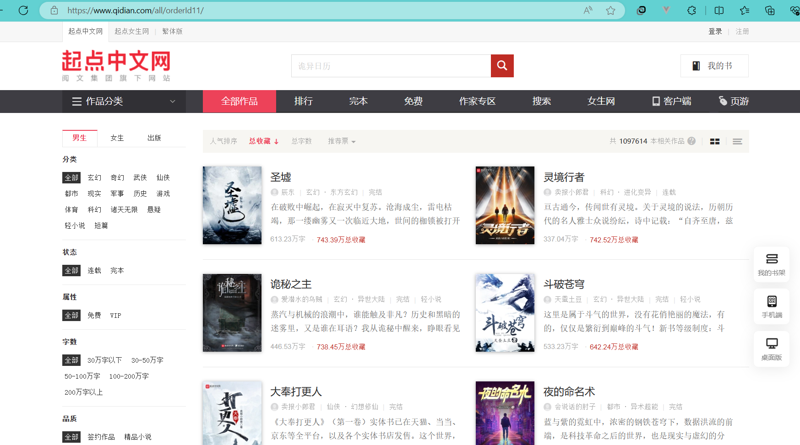

# 食用指南
## 基于django的小说网站

### Django + Scrapy

### 实现功能
1. 邮箱认证注册，邮箱/用户名登录
2. 小说分类，排行，收藏等功能
3. 小说/作者详情页展示
4. 多级评论，富文本编辑器
5. 用户详细信息登记
6. 书架

### 数据来源：起点中文网
https://www.qidian.com/all

### 配置
**必要配置(相关库按照标红自行安装即可)**
新建local_settings.py文件，文件内容如下：


```python
# -*- coding:utf-8 -*-

LANGUAGE_CODE = 'zh-hans'
#redis 
CACHES = {
    "default": {
        "BACKEND": "django_redis.cache.RedisCache",
        "LOCATION": "redis://127.0.0.1:6379",
        "OPTIONS": {
            "CLIENT_CLASS": "django_redis.client.DefaultClient",
            "CONNECTION_POOL_KWARGS": {"max_connections": 1000,"encoding":"utf-8"},
            "PASSWORD": "***",#密码
        }
    }
}
#mysql
DATABASES = {
#配置数据库链接属性
    'default': {
        'ENGINE': 'django.db.backends.mysql',  # 或者使用 mysql.connector.django
        'NAME': '***',#数据库名
        'USER': '***',#用户名
        'PASSWORD': '***',#密码
        'HOST': '127.0.0.1',
        'PORT': '3306',
    }
}


#邮件相关配置
EMAIL_BACKEND = 'django.core.mail.backends.smtp.EmailBackend'# 发送邮件配置
EMAIL_HOST = 'smtp.qq.com'# 服务器名称
EMAIL_PORT = 25# 服务端口
EMAIL_HOST_USER = '****@qq.com' # 填写自己邮箱
EMAIL_HOST_PASSWORD = '****'# 在邮箱中设置的客户端授权密码
EMAIL_FROM = '***'# 收件人看到的发件人
DEFAULT_FROM_EMAIL = EMAIL_HOST_USER
EMAIL_USE_TLS = True   #是否使用TLS安全传输协议
# EMAIL_USE_SSL = True    #是否使用SSL加密，qq企业邮箱要求使用

```

### 使用方法
#### 打开终端
1. 迁移数据库
```
python manage.py makemigrations
python manage.py migrate
```
2. **爬取相关数据，使用前先注释 return localbook() 语句，运行一次过后再取消注释执行即可**
```
执行下列语句
(爬虫) PS C:\Users\l1\Desktop\scrapy_django> cd qidianspider 
(爬虫) PS C:\Users\l1\Desktop\scrapy_django\qidianspider> cd qidianspider     
(爬虫) PS C:\Users\l1\Desktop\scrapy_django\qidianspider\qidianspider> cd spiders
(爬虫) PS C:\Users\l1\Desktop\scrapy_django\qidianspider\qidianspider\spiders> scrapy crawl thebook
```
3. 执行Django项目
```
python manage.py runserver
```
### 代码实现
#### 爬虫
1.表设计

**书籍表**
```python
class Books(models.Model):
    name = models.CharField(verbose_name='书名',max_length=30, unique=True)  #
    author = models.ForeignKey(verbose_name='作者',to='Authors',db_column='author', on_delete=models.CASCADE, )  #
    book_icon = models.CharField(verbose_name='封面',max_length=255)  #
    state = models.BooleanField(verbose_name='状态',default=False)  #flase连载，true完结
    prop_choice = (
        (1, '免费'),
        (2, 'VIP')
    )
    prop=models.SmallIntegerField(verbose_name='属性', choices=prop_choice)
    type = models.CharField(verbose_name='书的种类大', max_length=10)
    category = models.CharField(verbose_name='书的类型小', max_length=30)
    word=models.CharField(verbose_name='字数',max_length=30)
    brief = models.TextField(verbose_name='简介', default='这个人很懒，还没有写简介')
    recommend = models.BigIntegerField(verbose_name='推荐票')
```
**作者表**

(也许Authors表继承 AbstractBaseUser会更好)
```python
class Authors(models.Model):
    name = models.CharField(verbose_name='笔名',max_length=30, unique=True)  
    icon = models.CharField(verbose_name='头像',max_length=255)  
    introduction = models.CharField(verbose_name='简介',max_length=255, default="新人")  
    book_total = models.IntegerField(verbose_name='作品数',default=0)  
    all_word = models.DecimalField(verbose_name='总字数(万)',max_digits=7, decimal_places=2)  
    start_work = models.IntegerField(verbose_name='创作天数',default=0)
```
**书籍收藏数表**
```python
class Collections(models.Model):
    bookname=models.ForeignKey(verbose_name='书名',to='Books',db_column='bookname',on_delete=models.CASCADE)
    coll_num=models.PositiveIntegerField(verbose_name='收藏数',blank=0)
```
2. 爬虫设计

**首先需要解决起点的字体的反爬**

打开起始url页面，选择一本书,可以看到，在收藏数显示？？？，而对应的标签有一个样式‘PCiagJxf’


搜索该样式


可以看到其中有几个字体文件的地址
下载其中的woff文件，使用工具查看
```python
font = TTFont('fonts.woff')
font.saveXML("font.xml")

#打开文件
#可以看到字体的映射关系如下

      <map code="0x18841" name="nine"/><!-- TANGUT COMPONENT-066 -->
      <map code="0x18843" name="eight"/><!-- TANGUT COMPONENT-068 -->
      <map code="0x18844" name="period"/><!-- TANGUT COMPONENT-069 -->
      <map code="0x18845" name="seven"/><!-- TANGUT COMPONENT-070 -->
      <map code="0x18846" name="one"/><!-- TANGUT COMPONENT-071 -->
      <map code="0x18847" name="three"/><!-- TANGUT COMPONENT-072 -->
      <map code="0x18848" name="five"/><!-- TANGUT COMPONENT-073 -->
      <map code="0x18849" name="two"/><!-- TANGUT COMPONENT-074 -->
      <map code="0x1884a" name="four"/><!-- TANGUT COMPONENT-075 -->
      <map code="0x1884b" name="six"/><!-- TANGUT COMPONENT-076 -->
      <map code="0x1884c" name="zero"/><!-- TANGUT COMPONENT-077 -->

#将十六进制转化为十进制
0x18844=100420
0x18845=100421
```
打开对应页面源代码，可以看到对应的位置也是十进制（每次打卡页面都会发生变化）


获取字体映射关系，并进行更改和替换
```python
#获取字体映射关系
font_cmap = font['cmap'].getBestCmap()

f = {'period':'.', 'four': 4, 'three': 3, 'six':6, 'zero': 0,
     'one': 1, 'eight' : 8,'seven': 7,'nine': 9,'five' : 5, 'two': 2}
#更改映射
for key in font_cmap:
    font_cmap[key] = f[font_cmap[key]]
#替换映射
for key in font_cmap:
    html_data = html_data.replace('&#'+str(key)+';',str(font_cmap[key]))
#保存页面
with open("okkk.html","w",encoding="utf-8") as f:
    f.write(html_data)
```

**解决字体反爬后，可以开始爬虫的设计了**

创建爬虫时使用的域名为qidian.com

此时需要将起始url更改为https://www.qidian.com/all/orderId11/
```python
start_urls = ["https://www.qidian.com/all/orderId11/"]
```

打开页面可以看到如下界面


从书名和作者中提取详情页面的url
```python
 li_list=response.xpath("//*[@id='book-img-text']/ul/li")
        for li in li_list:
            name=li.xpath("./div[2]/h2/a/@href").extract_first()#作者详情地址
            href= li.xpath("./div[2]/p/a[1]/@href").extract_first()#小说详情地址
```

通过yield发起新请求，回调起解析函数
```python
 yield scrapy.Request(
        url='https:{}'.format(href),
        method='get',
        callback=self.parse_author
        , dont_filter=True
    )
    
yield scrapy.Request(
        url='https:{}'.format(name),
        method='get',
        callback=self.parse_book
        , dont_filter=True
    )
```
提取相关信息，送入管道存储
```python
    def parse_book(self,response,**kwargs):
        book_icon='https:'+response.xpath('//*[@id="bookImg"]/img/@src').get()
        name=response.xpath('//*[@id="bookName"]/text()').get()
        author = response.xpath('//div[@class="book-info-top"]//span[1]/text()').extract_first()
        state = response.xpath('//div[@class="book-info-top"]//span[2]/text()').get()
        prop = response.xpath('//div[@class="book-info-top"]//span[6]/text()').get()
        type = response.xpath('//div[@class="book-info-top"]//a[1]/text()').get()
        category = response.xpath('//div[@class="book-info-top"]//a[2]/text()').get()
        word = response.xpath('//div[@class="book-info-top"]//em[1]/text()').get()
        recommend = int(float(response.xpath('//div[@class="book-info-top"]//em[2]/text()').get()[:-1])*10000)
        brief=''.join(response.xpath('//*[@id="book-intro-detail"]/text()').extract())
        print(book_icon,name,author,state,prop,type,category,word,recommend,brief)
        item = XiaoshuoItem()
        item['name'] = name
        item['book_icon'] = book_icon
        item['author'] = author
        item['state'] = False if state=='连载' else True
        item['prop'] =  2 if prop=='VIP' else 1
        item['type'] = type
        item['category'] = category
        item['word'] = word
        item['recommend'] =recommend
        item['brief'] = brief
        yield item


    def parse_author(self, response, **kwargs):
        name = response.xpath("//div[@class='header-msg']/h1/text()").extract_first()
        icon = response.xpath("//div[@class='header-avatar']/img/@src").extract_first()
        introduction = response.xpath("//div[@class='header-msg-desc']/text()").extract_first()
        if not introduction:
            introduction="暂无相关介绍"
        book_total = response.xpath("//div[@class='header-msg-data']/span[1]/strong/text()").extract_first()
        all_word = response.xpath("//div[@class='header-msg-data']/span[2]/strong/text()").extract_first()
        start_work = response.xpath("//div[@class='header-msg-data']/span[3]/strong/text()").extract_first()
        print(name,icon,introduction,book_total,all_word,start_work)
        item = authorsItem()
        item['name']=name
        item['icon']=icon
        item['introduction'] = introduction
        item['book_total'] = book_total
        item['all_word'] =all_word
        item['start_work'] = start_work
        yield item
```

从本地解析的文件提取收藏数
```python
def localbook():
    body = open(r'C:\Users\l1\Desktop\scrapy_django\okkk.html', encoding='utf-8').read()
    res = Selector(text=body)
    local_list = res.xpath('//*[@id="book-img-text"]/ul/li')
    for li in local_list:
        bookname= li.xpath("./div[2]/h2/a/text()").extract_first()
        coll_num =int(float(li.xpath('./div[2]/p[3]/span/b[2]/span/text()').get())*10000)
        print(bookname, coll_num)
        item=collectionItem()
        item['bookname']=bookname
        item['coll_num']=coll_num
        yield item
```

因为这是本地文件，所以不需要发请求获取数据，直接返回调用即可，本案例中需要最后执行（因为数据库约束），你可以新建一个py文件单独使用
```python
return localbook()
```

管道存储，open_spider，close_spider仅在爬虫开始和结束时执行一次
```python
class BookMysqlPipeline:
    def open_spider(self, spider):
        #连接mysql
        self.conn = pymysql.connect(
            database=MYSQL['database'],
            user=MYSQL['USER'],
            password=MYSQL['PASSWORD'],
            host=MYSQL['HOST'],
            port=MYSQL['PORT'],
            charset=MYSQL['charset']
        )
        self.cursor = self.conn.cursor()

    def close_spider(self, spider):
        self.cursor.close()
        self.conn.close()

    def process_item(self, item, spider):
        try:
            if isinstance(item, XiaoshuoItem):#判断数据类型
                sql = 'select id from web_authors where web_authors.name=%s'
                self.cursor.execute(sql,item['author'])
                response2 = self.cursor.fetchall()
                item['author']=response2
                sql = "insert into web_books (name,author,book_icon,type,state,prop,category,word,recommend,brief,collection) values (%s,%s,%s,%s,%s,%s,%s,%s,%s,%s,%s)"
                self.cursor.execute(sql, (item['name'], item['author'], item['local_path'], item['type'],item['state'], item['prop'], item['category'], item['word'],item['recommend'],item['brief'],False))
                print('book收集完成')

            elif isinstance(item, authorsItem):
                sql = "insert into web_authors (name,icon,introduction,book_total,all_word,start_work) values (%s,%s,%s,%s,%s,%s)"
                self.cursor.execute(sql, (item['name'], item['local_path'], item['introduction'], item['book_total'],item['all_word'], item['start_work']))
                print('author收集完成')
            else:
                sql = 'select id from web_books where web_books.name=%s'
                self.cursor.execute(sql, item['bookname'])
                response2 = self.cursor.fetchall()
                item['bookname'] = response2
                sql = "insert into web_collections (coll_num,bookname) values (%s,%s)"
                self.cursor.execute(sql, (item['coll_num'], item['bookname']))
                print('collection收集完成')
            self.conn.commit()
        except Exception as e:
            print(e)
            print(item)
            self.conn.rollback()
        return item
```

图片存储
```python
class BookPipeline(ImagesPipeline):  # 继承图片管道
    def get_media_requests(self, item, info):
        if isinstance(item, collectionItem):
            return item
        if isinstance(item, authorsItem):
            #设置body，用于判断存储的路径
            yield scrapy.Request(item['icon'],body='author')
        else:
            yield scrapy.Request(item['book_icon'])

    def file_path(self, request, response=None, info=None, *, item=None):
        # print('assssaaaaa',request.body)
        file_name = item['name'] + '.jpg'
        if request.body:
            return f"author/{file_name}"
        return f"book/{file_name}"
    
    def item_completed(self, results, item, info):
        if isinstance(item, collectionItem):
            return item
        ok, finfo = results[0]
        #保存当前存储路径
        item['local_path'] = finfo['path']
        # print(item)
        return item
```

全站爬取
```python
#在spider中
url='https://www.qidian.com/all/orderId11-page%d/'
page=2
#parse中进行判断
if self.page <= 10:#获取的页数
    # 拼接新的url
    new_url = format(self.url%self.page)
    self.page += 1
    # 手动请求发送。
    yield scrapy.Request(url=new_url, callback=self.parse)
```
对于全站爬取，还可以使用CrawlSpider，这是Spider的一个子类，在Crawlspider中可以使用Rule向不同的链接发送请求，只需要设置follow即可爬取全站
```python
start_urls = ["https://www.qidian.com/all"]
# 使用链接提取器，提取书籍页链接
blocklink = LinkExtractor(allow=r"/book/\d+")
# follow=True表示爬取全站
Rule(book_link, callback="parseok",follow=True),
```


